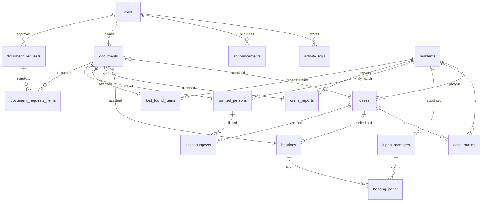

# Database Plan — Barangay E-Services Backend Admin Panel

Database engine: **MySQL 8+** (portable to MariaDB/PostgreSQL with minor changes).
Purpose: backend admin panel for managing every module on the barangay portal —
announcements, residents, Lupon cases & hearings, crime registry & wanted persons,
lost & found, and the PNP document workflow.

---

## 1. Design Conventions

| Rule | Convention |
| --- | --- |
| Primary key | `BIGINT UNSIGNED AUTO_INCREMENT` named `id` |
| Timestamps | `created_at`, `updated_at` (`DATETIME`, default `CURRENT_TIMESTAMP`) |
| Soft delete | `status` column per table (never hard-delete records) |
| Foreign keys | Named `fk_<child>_<parent>`, with `ON DELETE CASCADE` only for junction tables |
| Files | Stored on disk/object storage; the DB keeps the path. Never store file blobs |
| Enums | Stored as `VARCHAR` + `CHECK` constraints (portable) or MySQL `ENUM` |
| Person "who" | Every person (complainant, respondent, claimant, finder, suspect) maps to `residents` where possible |
| Central files | One `documents` table attaches files to any entity (case, hearing, crime report, lost item, etc.) |

---

## 2. Entity Relationship Overview

---

## 3. Module 1 — Admin Users, Roles & Audit

### `users` — administrator accounts
| Column | Type | Notes |
| --- | --- | --- |
| id | BIGINT PK | |
| username | VARCHAR(50) | unique |
| email | VARCHAR(120) | unique, nullable |
| password_hash | VARCHAR(255) | bcrypt/argon2 |
| full_name | VARCHAR(120) | |
| role | VARCHAR(20) | `admin`, `staff`, `lupon`, `pnp_authorized` |
| status | VARCHAR(20) | `active`, `inactive`, `locked` |
| last_login_at | DATETIME | |
| created_at / updated_at | DATETIME | |

### `permissions` — RBAC flags per role
| Column | Type | Notes |
| --- | --- | --- |
| id | BIGINT PK | |
| role | VARCHAR(20) | matches `users.role` |
| module | VARCHAR(50) | e.g. `cases`, `wanted_persons` |
| can_create / can_read / can_update / can_delete | TINYINT(1) | |

### `activity_logs` — audit trail
| Column | Type | Notes |
| --- | --- | --- |
| id | BIGINT PK | |
| user_id | BIGINT FK → users | nullable (system actions) |
| action | VARCHAR(30) | `create`, `update`, `delete`, `login`, `approve` |
| module | VARCHAR(50) | `hearings`, `wanted_persons`, … |
| entity_type | VARCHAR(30) | table name |
| entity_id | BIGINT | row affected |
| details | JSON | before/after snapshot |
| ip_address | VARCHAR(45) | IPv6-ready |
| created_at | DATETIME | |

---

## 4. Module 2 — Residents & Persons

### `residents` — master "person" records (PH profile fields)
| Column | Type | Notes |
| --- | --- | --- |
| id | BIGINT PK | |
| first_name / middle_name / last_name | VARCHAR(60) | last required |
| name_suffix | VARCHAR(10) | Jr., Sr., III |
| alias | VARCHAR(60) | nickname/known alias |
| sex | VARCHAR(10) | `male`, `female` |
| birth_date | DATE | |
| civil_status | VARCHAR(15) | `single`, `married`, … |
| contact_number | VARCHAR(20) | |
| email | VARCHAR(120) | nullable |
| house_no | VARCHAR(20) | |
| purok | VARCHAR(40) | |
| street | VARCHAR(60) | |
| zone | VARCHAR(20) | |
| barangay / municipality / province | VARCHAR(60) | default: current barangay |
| blood_type | VARCHAR(3) | nullable |
| occupation | VARCHAR(60) | |
| emergency_contact | VARCHAR(120) | |
| profile_photo | VARCHAR(255) | file path |
| status | VARCHAR(20) | `active`, `inactive`, `deceased` |
| registered_at | DATETIME | |

### `barangay_officials` — elected official roster
| Column | Type | Notes |
| --- | --- | --- |
| id | BIGINT PK | |
| resident_id | BIGINT FK → residents | |
| position | VARCHAR(60) | `Punong Barangay`, `Kagawad`, `Secretary`, … |
| term_start / term_end | DATE | |
| status | VARCHAR(20) | `active`, `inactive` |

---

## 5. Module 3 — Announcements

### `announcements`
| Column | Type | Notes |
| --- | --- | --- |
| id | BIGINT PK | |
| title | VARCHAR(160) | |
| body | TEXT | |
| category | VARCHAR(20) | `advisory`, `event`, `health`, `project`, `alert` |
| is_pinned | TINYINT(1) | |
| is_published | TINYINT(1) | draft vs live |
| author_id | BIGINT FK → users | |
| published_at | DATETIME | nullable |
| expires_at | DATETIME | nullable |
| created_at / updated_at | DATETIME | |

Attachments (flyers, PDFs, images) → generic `documents` table (`entity_type = 'announcement'`).

---

## 6. Module 4 — Cases, Lupon & Hearings

### `cases` — one row per complaint/docket
| Column | Type | Notes |
| --- | --- | --- |
| id | BIGINT PK | |
| case_reference | VARCHAR(30) | UNIQUE — shown on the site's hearing tracker |
| case_type | VARCHAR(30) | `lupon`, `crime`, `administrative` |
| nature | VARCHAR(80) | e.g. `theft`, `boundary dispute`, `slander` |
| subject/title | VARCHAR(160) | |
| summary | TEXT | |
| status | VARCHAR(25) | `docketed`, `for_preliminary`, `for_hearing`, `resolved`, `dismissed`, `archived` |
| filed_date | DATE | |
| lupon_panel_id | BIGINT FK → lupon_panels | nullable |
| created_by | BIGINT FK → users | |
| created_at / updated_at | DATETIME | |

### `case_parties` — complainants, respondents, witnesses
| Column | Type | Notes |
| --- | --- | --- |
| id | BIGINT PK | |
| case_id | BIGINT FK → cases | |
| resident_id | BIGINT FK → residents | |
| role | VARCHAR(20) | `complainant`, `respondent`, `witness`, `guardian` |
| notes | VARCHAR(255) | nullable |

### `lupon_panels` — a panel assembled for a case
| Column | Type | Notes |
| --- | --- | --- |
| id | BIGINT PK | |
| name | VARCHAR(120) | e.g. "Pangkat 1 Panel" |
| created_by | BIGINT FK → users | |

### `hearing_panel` — which lupon members sat on a hearing
| Column | Type | Notes |
| --- | --- | --- |
| id | BIGINT PK | |
| hearing_id | BIGINT FK → hearings | |
| lupon_member_id | BIGINT FK → lupon_members | |
| role | VARCHAR(20) | `chairman`, `member`, `secretary` |

### `lupon_members` — appointed Lupon Tagapamayapa
| Column | Type | Notes |
| --- | --- | --- |
| id | BIGINT PK | |
| resident_id | BIGINT FK → residents | |
| position | VARCHAR(40) | e.g. `Pangkat Chairman` |
| resolution_no | VARCHAR(30) | appointment reference |
| appointment_date | DATE | |
| expiry_date | DATE | nullable |
| status | VARCHAR(20) | `active`, `inactive` |

### `hearings` — one scheduled/held hearing per case
| Column | Type | Notes |
| --- | --- | --- |
| id | BIGINT PK | |
| case_id | BIGINT FK → cases | |
| hearing_no | INT | sequence per case |
| scheduled_date | DATE | |
| start_time / end_time | TIME | |
| venue | VARCHAR(120) | |
| status | VARCHAR(20) | `scheduled`, `held`, `postponed`, `cancelled` |
| outcome_notes | TEXT | mediating outcome, settlement |
| created_by | BIGINT FK → users | |
| created_at / updated_at | DATETIME | |

Hearing files (minutes, subpoenas, settlement sheets) → `documents` (`entity_type = 'hearing'`).

---

## 7. Module 5 — Crime Registry & Wanted Persons

### `crime_reports` — incidents shown on the public registry
| Column | Type | Notes |
| --- | --- | --- |
| id | BIGINT PK | |
| title | VARCHAR(160) | e.g. "Incident: Theft Report" |
| incident_type | VARCHAR(30) | `theft`, `robbery`, `vandalism`, `disturbance`, `assault`, `other` |
| description | TEXT | |
| incident_date | DATETIME | |
| location | VARCHAR(120) | purok/zone/landmark |
| severity | VARCHAR(10) | `low`, `medium`, `high` |
| status | VARCHAR(20) | `active`, `under_investigation`, `resolved`, `closed` |
| reported_by | BIGINT FK → residents | nullable |
| remarks | TEXT | for internal notes |
| created_at / updated_at | DATETIME | |

### `wanted_persons` — posted to community, searchable
| Column | Type | Notes |
| --- | --- | --- |
| id | BIGINT PK | |
| resident_id | BIGINT FK → residents | nullable if not a tracked resident |
| first_name / middle_name / last_name | VARCHAR(60) | |
| alias | VARCHAR(60) | |
| sex | VARCHAR(10) | |
| birth_date | DATE | nullable |
| photo | VARCHAR(255) | file path |
| danger_level | VARCHAR(10) | `low`, `moderate`, `high` |
| charges_or_description | TEXT | |
| last_known_location | VARCHAR(120) | |
| status | VARCHAR(20) | `wanted`, `arrested`, `cleared`, `deactivated` |
| created_at / updated_at | DATETIME | |

### `case_suspects` — link a case to suspects/wanted persons
| Column | Type | Notes |
| --- | --- | --- |
| id | BIGINT PK | |
| case_id | BIGINT FK → cases | |
| wanted_person_id | BIGINT FK → wanted_persons | nullable |
| resident_id | BIGINT FK → residents | nullable |
| status | VARCHAR(20) | `suspect`, `person_of_interest`, `cleared`, `charged` |

---

## 8. Module 6 — Lost & Found

### `lost_found_items`
| Column | Type | Notes |
| --- | --- | --- |
| id | BIGINT PK | |
| type | VARCHAR(10) | `lost`, `found` |
| item_name | VARCHAR(120) | |
| category | VARCHAR(40) | `id`, `phone`, `wallet`, `keys`, `jewelry`, … |
| description | TEXT | distinguishing marks |
| location | VARCHAR(120) | where lost / where found |
| date_lost_found | DATE | |
| photo | VARCHAR(255) | file path, nullable |
| status | VARCHAR(20) | `open`, `pending_claim`, `claimed`, `returned`, `closed` |
| reported_by | BIGINT FK → residents | finder or loser |
| claimant_id | BIGINT FK → residents | nullable — claimed by |
| claimed_at | DATETIME | |
| created_at / updated_at | DATETIME | |

---

## 9. Module 7 — Documents, Files & PNP Requests (Central)

### `documents` — every uploaded file, attached to any entity
| Column | Type | Notes |
| --- | --- | --- |
| id | BIGINT PK | |
| entity_type | VARCHAR(30) | `case`, `hearing`, `crime_report`, `announcement`, `lost_found_item`, `wanted_person`, `resident`, `user` |
| entity_id | BIGINT | FK depends on entity_type |
| doc_type | VARCHAR(40) | `cfa`, `subpoena`, `hearing_log`, `complaint_record`, `settlement`, `certificate`, `photo`, `proof`, `misc` |
| title | VARCHAR(160) | |
| description | TEXT | nullable |
| file_name | VARCHAR(255) | original name |
| file_path | VARCHAR(500) | stored path / object key |
| mime_type | VARCHAR(80) | |
| file_size | BIGINT | bytes |
| version | INT | default 1 |
| is_public | TINYINT(1) | visible on portal vs admin-only |
| uploaded_by | BIGINT FK → users | |
| uploaded_at | DATETIME | |

### `document_requests` — PNP / office file requests
| Column | Type | Notes |
| --- | --- | --- |
| id | BIGINT PK | |
| request_code | VARCHAR(30) | UNIQUE reference |
| requester_id | BIGINT FK → users | PNP-authorized user |
| requesting_office | VARCHAR(120) | e.g. "Local PNP Station — Kaso de Pulis" |
| purpose | VARCHAR(255) | |
| status | VARCHAR(20) | `pending`, `approved`, `rejected`, `fulfilled` |
| approved_by | BIGINT FK → users | nullable |
| reviewed_at | DATETIME | |
| notes | TEXT | |
| requested_at / fulfilled_at | DATETIME | |

### `document_request_items` — one line per requested file
| Column | Type | Notes |
| --- | --- | --- |
| id | BIGINT PK | |
| request_id | BIGINT FK → document_requests | |
| document_id | BIGINT FK → documents | nullable — which file fulfills it |
| entity_type / entity_id | VARCHAR(30)/BIGINT | fallback if attached to a case directly |
| notes | VARCHAR(255) | |

---

## 10. Module 8 — Settings

### `settings` — site-wide key/value config
| Column | Type | Notes |
| --- | --- | --- |
| id | BIGINT PK | |
| key | VARCHAR(60) | UNIQUE |
| value | TEXT | JSON-able |
| updated_by | BIGINT FK → users | |

---

## 11. Admin Panel → Table Map

| Admin panel section | Screen | Main tables | CRUD | Public site widget |
| --- | --- | --- | --- | --- |
| Dashboard | Stats + recent activity | activity_logs, cases, crime_reports | read | Stats counters |
| Announcements | List / compose / pin | announcements, documents | CRUD | Announcements section |
| Residents | Master list / profile | residents, documents | CRUD | (future) sign-up |
| Cases | Docket / parties | cases, case_parties, case_suspects | CRUD | Hearing tracker search |
| Hearings | Schedule sheet / calendar | hearings, hearing_panel, lupon_members, lupon_panels | CRUD | Tracking result by case no. |
| Crime Registry | Incident list | crime_reports, documents | CRUD | Safety & Crime Registry cards |
| Wanted Persons | Wanted posters | wanted_persons, documents | CRUD | (future public listing) |
| Lost & Found | Item ledger / claim | lost_found_items, documents | CRUD | Lost & Found tabs |
| Documents | File repository / upload | documents | CRUD | PNP download links |
| PNP Requests | Request queue / approve | document_requests, document_requests_items | Approve/Fulfill | "Request PDF Records" form |
| Users & Roles | Accounts / permissions | users, permissions, activity_logs | CRUD | Admin Login |
| Settings | Site config | settings | Update | navbar/contacts |

---

## 12. Indexes & Performance Notes

- Index every `entity_type + entity_id` pair on `documents` (polymorphic lookups).
- `cases.case_reference` and `document_requests.request_code` are UNIQUE — used in public tracker lookups.
- Full-text index on `wanted_persons(first_name, last_name, alias)` and `residents(last_name)` for search.
- `hearings(case_id, scheduled_date)` composite index for calendar views.
- JSON columns (`activity_logs.details`) require MySQL 5.7+/8.0.

## 13. Security Notes

- Passwords hashed (bcrypt/argon2); never store plaintext.
- `is_public` flag on `documents` gates what leaves the admin panel; PNP requests require a `pnp_authorized` role and are audit-logged.
- All mutations create an `activity_logs` row for accountability.
- Back up `documents.file_path` storage alongside the DB; DB alone does not back up the files.